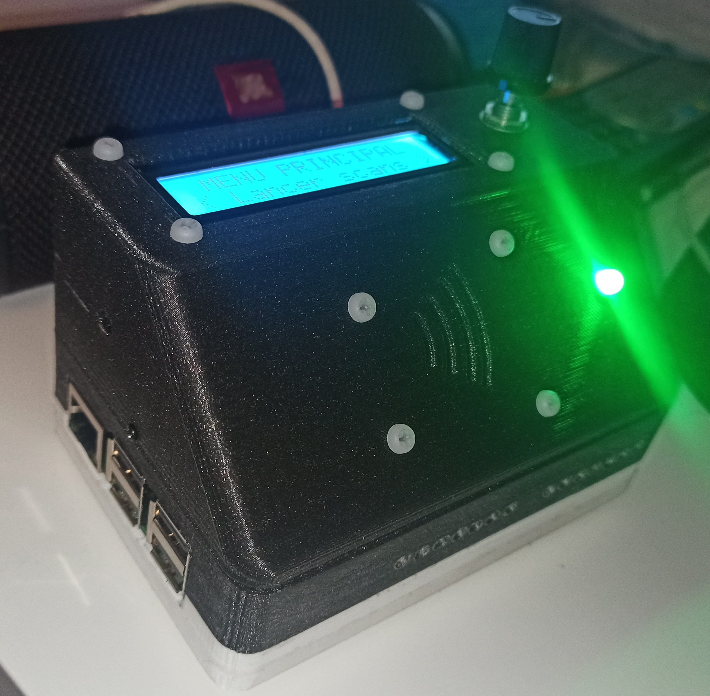

# UTBM TZ20 Project

Welcome to the Github repository of our project !  
It consists in designing, building and programming a full portable console allowing the University of Technology of Belfort-Montbeliard (France) staff to control students attendance at some mandatory events.  
This project involves Raspberry Pi programming through Python, 3D printing, and electronics.
This repository contains all documents related to the project.



## Useful links : ##

| Description                                             | URL                                                                                                            | We used it for :                                                                                                 |
|---------------------------------------------------------|----------------------------------------------------------------------------------------------------------------|------------------------------------------------------------------------------------------------------------------|
| RC522 wiring guide                                      | [Click here](https://pimylifeup.com/raspberry-pi-rfid-rc522/)                                                  | Wiring RC522 module to the Raspberry Pi. For programming, refer to the line below                                |
| RC522 python class                                      | [Click here](https://github.com/danjperron/MFRC522-python)                                                     | Programming the Raspberry Pi for controlling the RC522 module, especially to read 7 bytes UIDs                   |
| Git handling from bash terminal                         | [Click here](https://medium.com/@panjeh/makefile-git-add-commit-push-github-all-in-one-command-9dcf76220f48 )  | Remind us how to handle a git repo from bash terminal                                                            |
| Change I2C pins on Raspberry Pi                         | [Click here](https://raspberrypi.stackexchange.com/questions/88149/change-i2c-pins-on-raspberry-pi)            | Opening a second I2C channel on the Raspberry Pi                                                                 |
| Python class for I2C enabled LCD screens                | [Click here](https://www.raspberrypi-spy.co.uk/2015/05/using-an-i2c-enabled-lcd-screen-with-the-raspberry-pi/) | Controlling the 16x2 I2C driven LCD screen through Python                                                        |
| Fan controlling from Raspberry Pi                       | [Click here](https://howchoo.com/g/ote2mjkzzta/control-raspberry-pi-fan-temperature-python)                    | Wiring and controlling a 5v fan to cool down Raspberry Pi CPU                                                    |
| Guide to run python script at Raspi startup             | [Click here](https://www.dexterindustries.com/howto/run-a-program-on-your-raspberry-pi-at-startup/#systemd)    | Creating a systemd service to run a Python script that reads CPU temp and controls the fan through an hysteresis |
| Guide for using a DS1302 RTC Module with a Raspberry Pi | [Click here](https://github.com/sourceperl/rpi.rtc)                                                            | Using an RTC DS1302 module to ensure a non-volatile time management                                              |
| Tutorial about using a config.ini file with Python      | [Click here](https://pymotw.com/2/ConfigParser/)                                                               | Storing user settings as non-volatile variables                                                                  |
| Forum about dismounting USB drive from Python           | [Click here](https://www.raspberrypi.org/forums/viewtopic.php?t=198250)                                        | Safe ejecting USB keys after importations and exportations

## Hardware (3D printing and electronics) ##
=======
Go to [hardware](hardware/README.md) to see an electronic schematic and our 3D model of the case.

## Installation ##
### By burning TZ20.img to an empty SD card (recommended) ###
>>>>>>> eb0ae4555269eb2e0d8dc44ecf4f938724aca84b

### By cloning this repository ###
Please follow the instructions below to proceed software installation :
1. Make sure wiring is correct (see section *Electronics* above)
2. Download and flash Raspbian or Minibian (command-line only) to an empty SD card (see [here](https://www.raspberrypi.org/documentation/installation/installing-images/))
3. Make sure your default user is named "pi" by opening a terminal (Ctrl + Alt + T) and typing
```
whoami
```
4. Clone this repository to */home/pi* :
```
git clone https://github.com/totordudu/UTBM_TZ20.git
```
5. Enable SPI and I2C interfaces via raspi-config wizard :
```
sudo raspi-config  
```
   * Using your keyboard arrows and Tab key, navigate to **Interfacing Options** and then **I2C**, then confirm
   * Repeat the same operation for **SPI** interface

6. Run install.sh from the new folder with sudo privileges (you must type your password, by default its *raspberry*) :
```
cd /home/pi/UTBM_TZ20/
sudo chmod +x install.sh
sudo ./install.sh
```
7. Check that *script/main.py* has *-rwxrwxrwx* permissions :
```
ls -l /home/pi/UTBM_TZ20/script/main.py
```
* Otherwise, give those permissions :
    ```
    sudo chmod 777 /home/pi/UTBM_TZ20/script/main.py
    ```

8. Then the script main.py should normally run by typing the following command : 
```
/usr/bin/python /home/pi/UTBM_TZ20/script/main.py
```

9. Restart your raspberry, and *main.py* should automatically start
```
sudo reboot now
```
