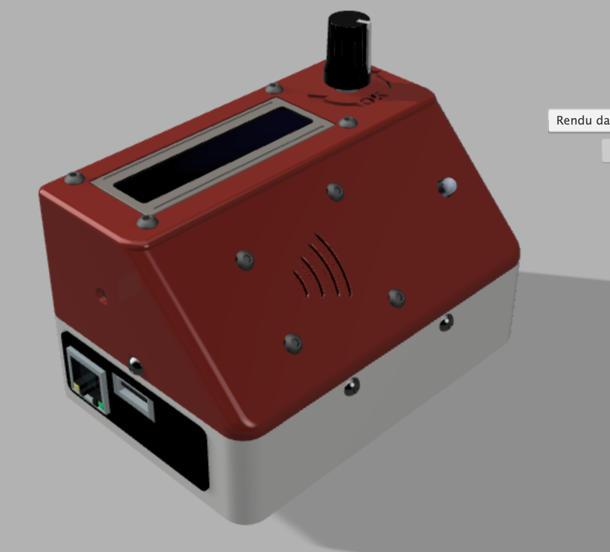
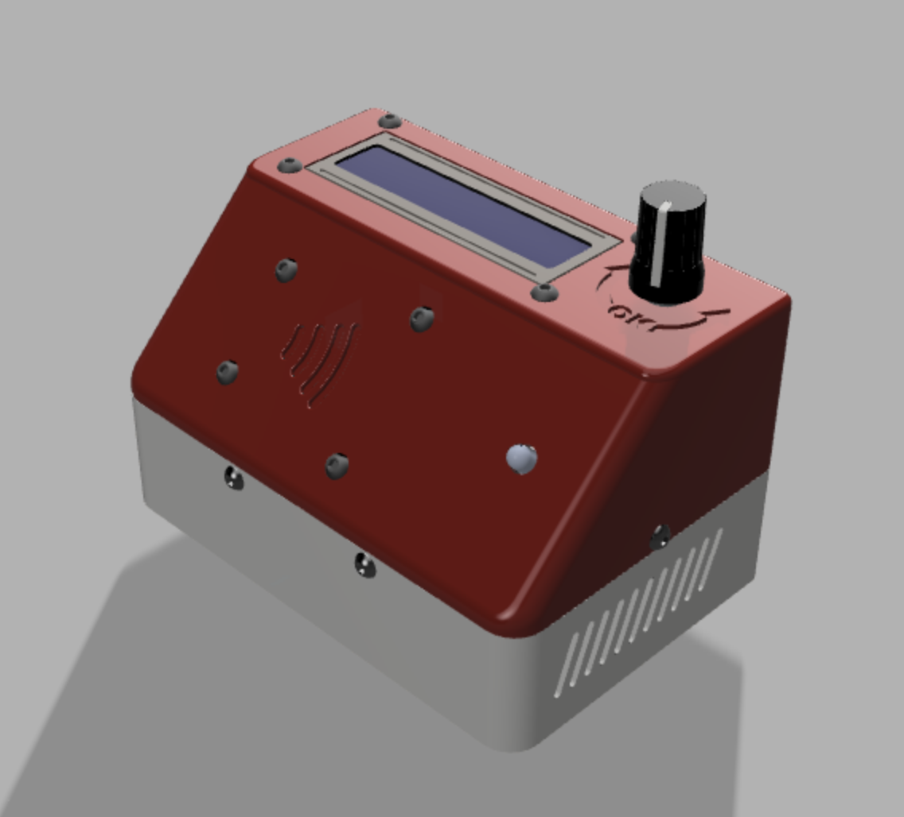
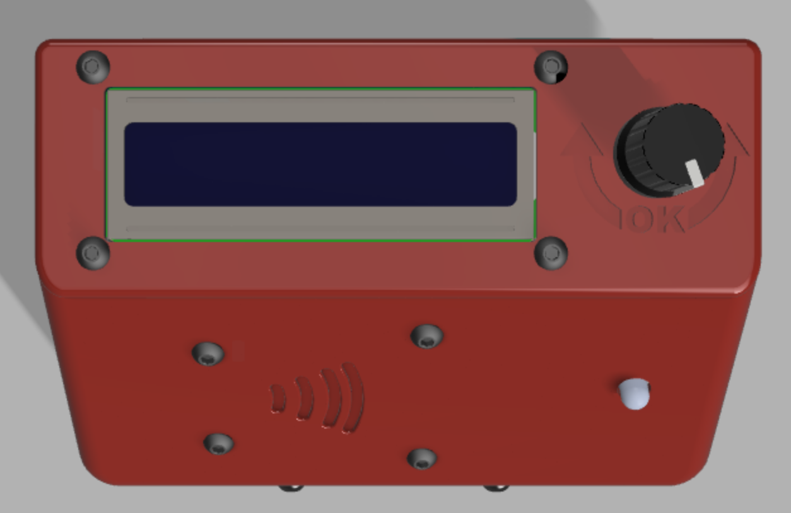
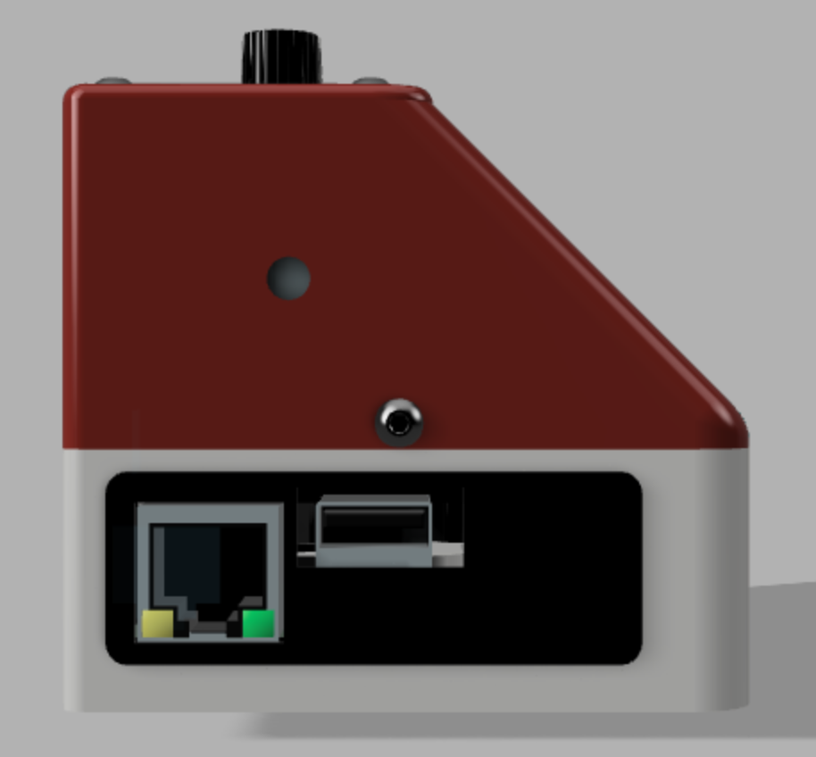
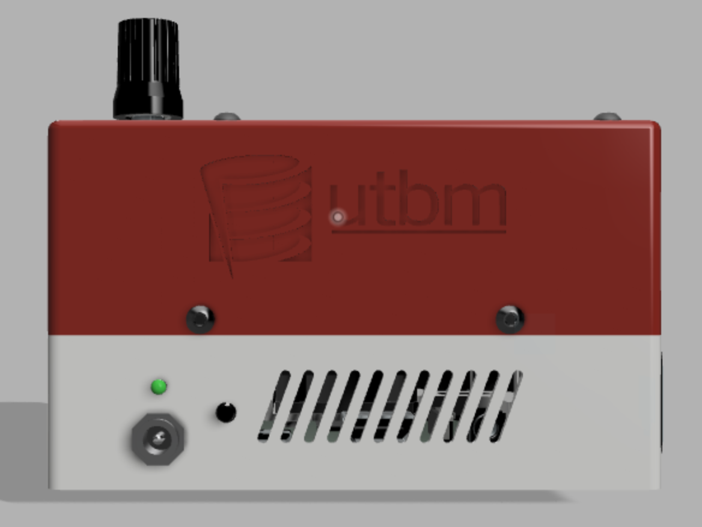
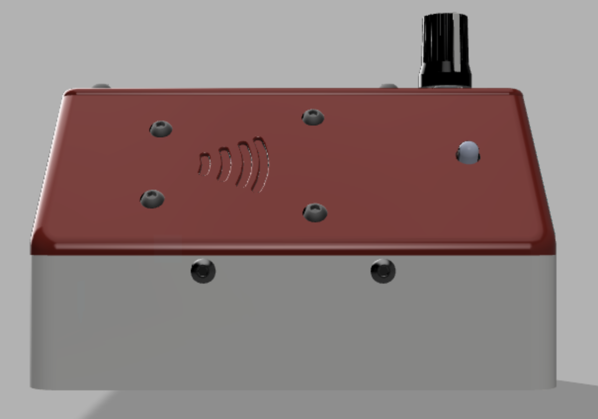
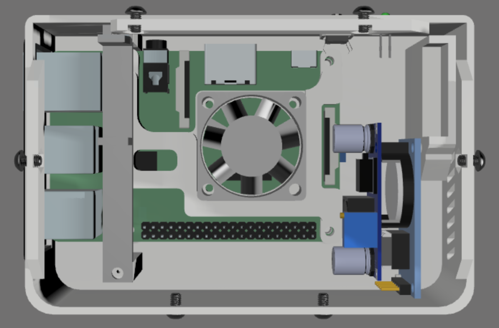
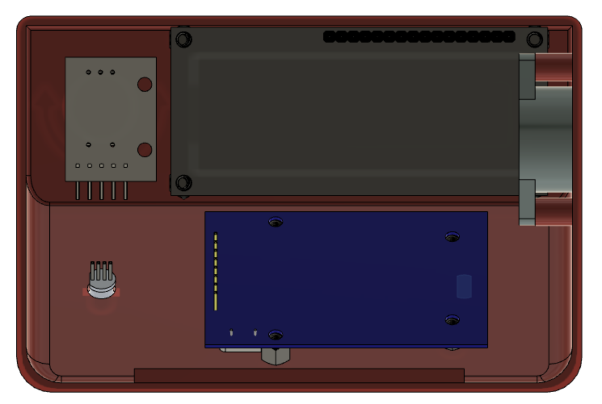
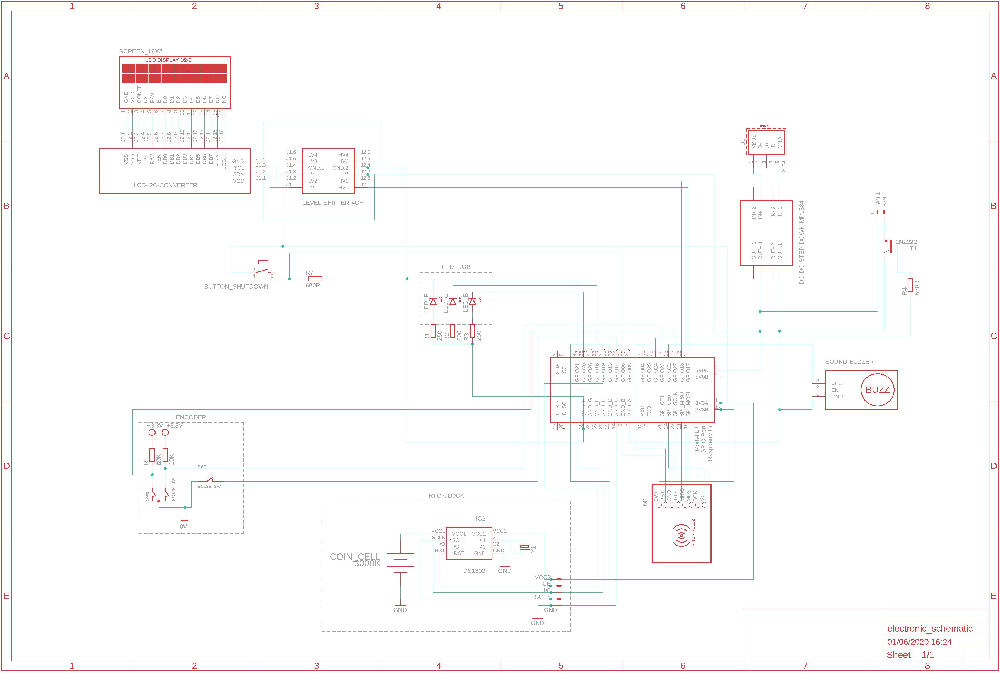

## Hardware

### 3D files

To design this box, we used Fusion 360. All the 3D files needed to build this box are available in 3D_prints folder.

Here are the rendering images of the conception. 

### Electronic

To create the scheamtic of the project, we used Eagle. Eagle is a very powerful tool made by Autodesk and can be linked with Fusion 360 which is really useful. 

Thanks to this tool, we made the following schematic. If you want more detail about it, a .sch file is available in the electronic folder. 

